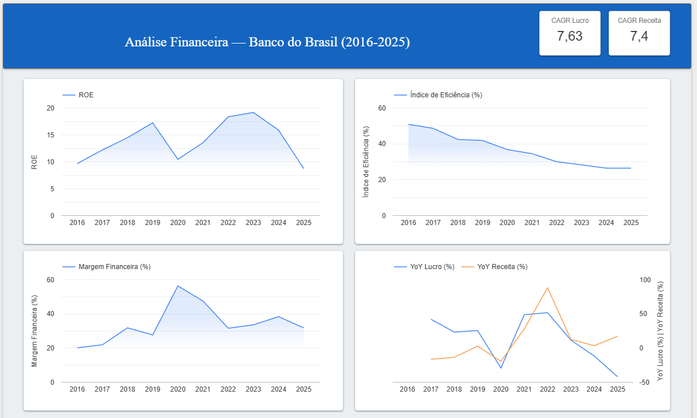

# Análise Financeira: Banco do Brasil (2016-2025)

Projeto de análise de dados aplicado a finanças, usando dados públicos
da CVM (Comissão de Valores Mobiliários) para estudar a evolução
financeira do Banco do Brasil S.A. na última década.

## Dashboard



🔗 [Acessar dashboard no Looker Studio]([https://datastudio.google.com/...](https://datastudio.google.com/reporting/982b0961-5f4f-45c1-9e86-4c52d3005031))

---

## Objetivo

Aplicar SQL, modelagem de dados e visualização para responder:
- Como evoluiu o ROE, Margem Financeira e Eficiência do BB entre 2016-2025?
- Qual foi o CAGR de receita e lucro no período?
- Como a transição para IFRS 9 (2018) afetou a comparabilidade dos dados?
- O que os dados revelam sobre a crise da carteira agro em 2024-2025?

---

## Indicadores calculados

| Indicador | Fórmula | Fonte |
|---|---|---|
| **ROE** | Lucro Líquido / Patrimônio Líquido | DRE + BPP |
| **Margem Financeira** | Resultado Bruto / Receita de Intermediação | DRE |
| **Índice de Eficiência** | Despesas Adm. / Receitas Operacionais | DRE |
| **YoY Lucro** | (Lucro atual − Lucro anterior) / Lucro anterior | DRE |
| **YoY Receita** | (Receita atual − Receita anterior) / Receita anterior | DRE |
| **CAGR Lucro** | (Lucro 2025 / Lucro 2016)^(1/9) − 1 | DRE |
| **CAGR Receita** | (Receita 2025 / Receita 2016)^(1/9) − 1 | DRE |

---

## Principais insights

- **ROE**: cresceu de 9,6% (2016) para 19,1% (2023) e caiu para 8,7% em 2025
  — menor nível da década, reflexo da inadimplência da carteira agro
- **Índice de Eficiência**: queda consistente de ~51% para ~26% em 10 anos
  — banco ficou significativamente mais eficiente operacionalmente
- **Margem Financeira**: pico de 56% em 2020 com Selic na mínima histórica (2%)
  — resultado bruto inflado pela queda das despesas de captação
- **Contraste 2025**: receita cresceu +16,8% mas lucro caiu −42,5%
  — provisões da carteira agro consumiram todo o crescimento de receita
- **CAGR**: lucro cresceu 7,63% a.a. e receita 7,40% a.a. em 9 anos
  — crescimento consistente apesar das oscilações do YoY

---

## Stack

- **Python** — extração e filtragem dos dados da CVM
- **PostgreSQL (Supabase)** — armazenamento e queries analíticas
- **SQL** — ROE, Margem, Eficiência, YoY, CAGR com CTEs e window functions
- **Looker Studio** — dashboard conectado diretamente ao PostgreSQL

---

## Fonte de dados

[Portal de Dados Abertos da CVM](https://dados.cvm.gov.br/dados/CIA_ABERTA/DOC/DFP/DADOS/)
— Demonstrações Financeiras Padronizadas (DFP), 2016-2025.

Dados extraídos automaticamente via Python (`scripts/baixar_dados_cvm.py`),
filtrados para o Banco do Brasil S.A. (CNPJ 00.000.000/0001-91) e
carregados em 3 tabelas PostgreSQL: `bpa`, `bpp`, `dre`.

---

## Modelo de dados

O projeto usa 3 tabelas com estrutura idêntica, representando os
três demonstrativos financeiros da CVM:

- `bpa` — Balanço Patrimonial Ativo
- `bpp` — Balanço Patrimonial Passivo (inclui Patrimônio Líquido)
- `dre` — Demonstração de Resultado

Não há chaves estrangeiras formais entre as tabelas. O cruzamento
é feito via `JOIN` usando `dt_refer` como critério de correspondência.

A VIEW `indicadores_bb` consolida todos os indicadores em uma única
consulta: `SELECT * FROM indicadores_bb;`

---

## Estrutura do repositório

```
├── scripts/
│   └── baixar_dados_cvm.py       # extração e filtragem dos dados da CVM
├── dados/
│   └── processados/
│       ├── bpa_bb.csv             # Balanço Ativo (2016-2025)
│       ├── bpp_bb.csv             # Balanço Passivo (2016-2025)
│       └── dre_bb.csv             # DRE (2016-2025)
├── queries/
│   ├── 01_roe_banco_brasil.sql    # ROE com JOIN entre DRE e BPP
│   ├── 02_margem_financeira.sql   # Margem Financeira com CASE WHEN e CTE
│   ├── 03_indice_eficiencia.sql   # Índice de Eficiência com nota metodológica
│   ├── 04_yoy.sql                 # YoY com window function LAG()
│   ├── 05_cagr.sql                # CAGR com POWER() e FILTER(WHERE)
│   └── 06_view_consolidada.sql    # VIEW com todos os indicadores
└── README.md
```

---

## Conceitos SQL aplicados

| Conceito | Onde foi usado |
|---|---|
| `JOIN` | ROE (cruzar DRE com BPP) |
| `WHERE` com `OR`/`AND` | Filtrar variações de nomenclatura da CVM |
| `SUM(CASE WHEN)` | Pivotar contas em colunas (Margem, Eficiência) |
| `GROUP BY` | Agregar por ano |
| CTEs (`WITH`) | Organizar queries complexas em etapas legíveis |
| CTEs encadeadas | VIEW consolidada com 10 CTEs |
| `LAG()` | YoY — window function que "olha a linha anterior" |
| `POWER()` | CAGR — potência para calcular taxa composta |
| `FILTER (WHERE)` | CAGR — filtrar linhas dentro de agregação |
| `CREATE VIEW` | Encapsular todos os indicadores em consulta simples |

---

## Nota metodológica — Índice de Eficiência

O BB divulga o IE com base em metodologia gerencial interna
("DRE realocado") que inclui itens como *Recuperação de Crédito*
e *Descontos Concedidos* — contas que não existem separadamente
no DFP público da CVM.

Nossa aproximação via dados públicos converge com os valores
oficiais a partir de 2022 (diferença < 2 p.p.), validando a
tendência mesmo que os valores absolutos de 2016-2019 difiram.

| Ano | Nossa métrica | Oficial BB |
|:---:|:---:|:---:|
| 2016 | 50,7% | 39,7% |
| 2022 | 29,8% | 29,4% |
| 2023 | 28,1% | 27,1% |
| 2024 | 26,3% | 25,6% |

---

## Status

✅ Fase 1 concluída — Análise do Banco do Brasil (2016-2025)

🔜 Fase 2 planejada — Expansão para análise setorial
(Itaú, Bradesco, Santander, BB) com `UNION ALL`

---

## Autor

**Lydson** — Analista de Operações com foco em dados financeiros

[GitHub](https://github.com/Lydson) · [LinkedIn]([https://linkedin.com/in/...](https://www.linkedin.com/in/lydson/))
